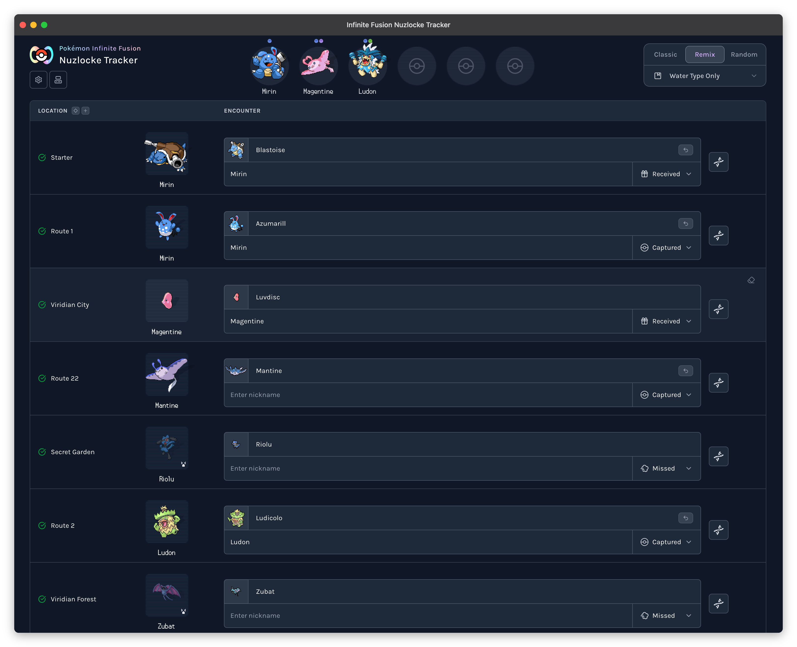

#  Infinite Fusion Nuzlocke Tracker

Track Pokemon Infinite Fusion Nuzlocke runs with encounter logging, team and box management, and fusion-aware workflows.

[](https://nextjs.org/)
[](https://react.dev/)
[](https://www.typescriptlang.org/)
[](LICENSE)

Live app: [fusion.nuzlocke.io](https://fusion.nuzlocke.io)  
Source: [github.com/fbosch/infinite-fusion-nuzlocke](https://github.com/fbosch/infinite-fusion-nuzlocke)



## Features

- Encounter tracking by location with quick actions and sorting
- Playthrough profiles with create/switch/delete and import/export
- Classic, Remix, and Randomized game mode support
- Team, PC, and graveyard flows that preserve run-state invariants
- Fusion-aware encounter handling and custom locations

## Quick Start

Requirements:

- Node.js `22.x`
- Corepack-enabled pnpm `10.x`

```bash
corepack enable
corepack prepare pnpm@10 --activate
pnpm install
pnpm dev
```

Open [http://localhost:4000](http://localhost:4000).

Runtime notes and rollback steps: `docs/NODE_24_MIGRATION.md`

## Common Scripts

```bash
pnpm dev
pnpm build
pnpm start

pnpm type-check
pnpm lint
pnpm validate

pnpm test
pnpm test:run
pnpm test:coverage

pnpm data:refresh
pnpm spritesheet
```

## Validation Workflow

For behavior or run-state changes, run checks in this order:

```bash
pnpm type-check
pnpm test:run
pnpm validate
```

## Release Workflow

Releases are automated with Release Please.

- Release policy and SemVer expectations: `docs/RELEASE_POLICY.md`
- Version boundary guidance: `docs/VERSION_BOUNDARIES.md`
- Release workflow: `.github/workflows/release-please.yml`

## Contributing

Contributions are welcome via issues and pull requests.

- Keep changes focused
- Add or update relevant tests
- Run `pnpm type-check`, `pnpm test:run`, and `pnpm validate` before opening a PR

Additional docs:

- SEO/canonical routing: `docs/SEO_CANONICAL_STRATEGY.md`
- Valtio React Compiler guidance: `docs/VALTIO_REACT_COMPILER_GUIDANCE.md`

## License

MIT License. See [`LICENSE`](LICENSE).
